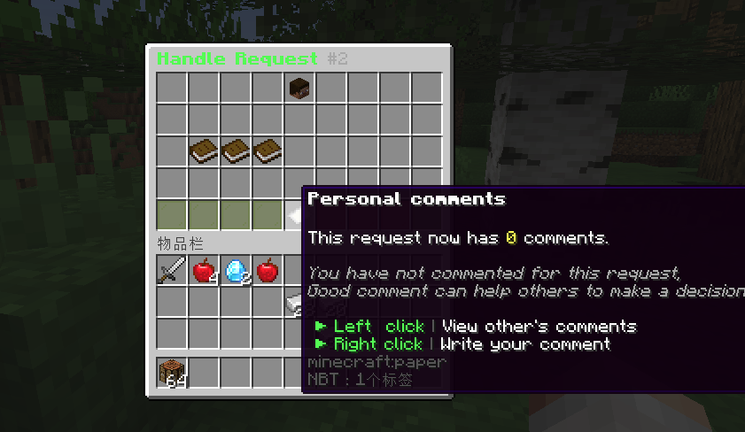

```text
 _    __      __       ____                 
| |  / /___  / /____  / __ \____ ___________
| | / / __ \/ __/ _ \/ /_/ / __ `/ ___/ ___/
| |/ / /_/ / /_/  __/ ____/ /_/ (__  |__  ) 
|___/\____/\__/\___/_/    \__,_/____/____/      
```

README LANGUAGES [ [**English**](README.md) | [中文](README_CN.md)  ]


[](https://github.com/ArtformGames/VotePass/releases)
[](https://github.com/ArtformGames/VotePass/actions/workflows/maven.yml)


# **VotePass**

> You have been **"Passed by Vote"** !

An efficient and fair verification plugin for whitelisted servers,
which supports players to submit whitelist requests by themselves
and be reviewed by all players who have passed.

> This plugin has been published on [SpigotMC](https://www.spigotmc.org/resources/votepass.111846/) and [Modrinth](https://modrinth.com/plugin/votepass/).


## Features & Advantages

- **Database Sync!** Based on database storage, data is safe and synchronized.
- **Easy to configure!** Simple and convenient configuration method, all content can be configured!
- **User-friendly GUI!** Full UI configuration, very easy for players to operate.
- **Player participation!** Players can participate in the management of the server, making them more involved.

## Screenshots




## Dependencies

- **[Recommend]** Placeholders based on [PlaceholderAPI](https://www.spigotmc.org/resources/6245/) .

For development dependencies, please
see  [Dependencies](https://github.com/ArtformGames/VotePass/network/dependencies) .

## Extensions

> Have you developed an extension plugin related to this plugin?
> Welcome to submit your extension plugin in [Issues](https://github.com/ArtformGames/VotePass/issues)
> and we will add it to the list!

### [**VotePass-Mailer**](https://github.com/ArtformGames/VotePass-Mailer)

Support email notify for VotePass in game servers.

### [**VotePass-QQNotify**](https://github.com/ArtformGames/VotePass-QQNotify)

Support QQ notify for VotePass in lobby servers.

## Commands

The main command is `/VotePass` or `/vp`.

### Lobby side

```text

# request <serverID>
@ Player command
- Submit a whitelist request for a specific server.
- If the server has configured the rules, the rule agreement will be opened first;
- If not, the question-related GUI will be popped up directly for the player to fill in.

# accept <serverID>
@ Player command
- Agree to the rules of the specified server and start filling in the answers to the questions.

# deny <serverID>
@ Player command
- Refuse the rules of the specified server.

# reload
@ Admin command
- Reload the configuration file.

# toggle <server>
@ Admin command
- Enable/Disable the vote application for the corresponding server.

```

### Game side

```text

# requests
@ Player command
- View all whitelist requests that have not been participated in.

# handle <requestID>
@ Player command
- (Continue to) process the specified whitelist request.

# abstain
@ Player command
- Enable/Disable the auto abstain function.

# manage
@ Admin command
- Open the administrator operation GUI to directly operate the whitelist.

# reload
@ Admin command
- Reload the configuration file.

# sync
@ Admin command
- Synchronize the whitelist of the corresponding server to the database.

# migrate
@ Admin command
- Migrate the whitelist of the server from the "whitelist.json".

# list
@ Admin command
- List all players in whitelist.

# add <username>
@ Admin command
- Add a player to the whitelist.
- Player should joined the server(e.g lobby) at least once.

# remove <username>
@ Admin command
- Remove a player from the whitelist.

```

## Configurations

You can find configuration translations
at [VotePass-Translations](https://github.com/ArtformGames/VotePass-Translations).

### Plugin Configuration (`config.yml`) .

Will be generated on the first boot up.

### Messages Configuration (`messages.yml`)

Will be generated on the first boot up.

### Server Application Configuration ([`servers/*.yml`](lobby/plugin/src/main/resources/servers/survival.yml))

All server's application configuration are separate configuration files,
stored in the lobby's `<Data Folder>/servers/` for easy management.

You can edit the storage path of the server configuration file in the plugin configuration file.

## Permissions

```text
# VotePass.admin
- The permissions for all admin commands and functions.

# VotePass.abstain
- The permission that allow user to toggle auto abstain.
```

## Statistics

[](https://bstats.org/plugin/bukkit/VotePass/18946)


## Open Source Licence

The source code of this project adopts the [GNU General Public License v3.0](https://opensource.org/licenses/GPL-3.0).

## Supports

This project is mainly developed by the [Artfrom Games](https://github.com/ArtformGames/) .


Many thanks to Jetbrains for kindly providing a license for us to work on this and other open-source projects.  

[](https://www.jetbrains.com/?from=https://github.com/ArtformGames/VotePass)

