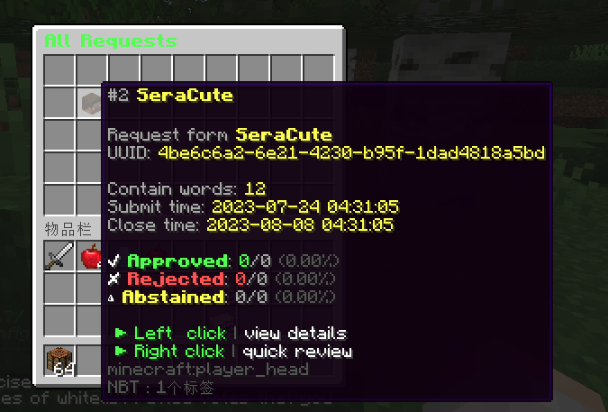
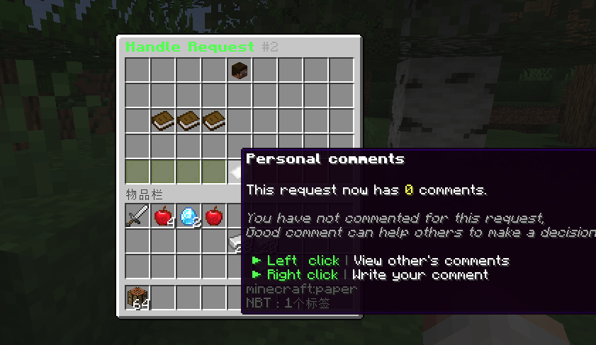

```text
 _    __      __       ____                 
| |  / /___  / /____  / __ \____ ___________
| | / / __ \/ __/ _ \/ /_/ / __ `/ ___/ ___/
| |/ / /_/ / /_/  __/ ____/ /_/ (__  |__  ) 
|___/\____/\__/\___/_/    \__,_/____/____/      
```

README LANGUAGES [ [English](README.md) | [**中文**](README_CN.md)  ]


[](https://github.com/ArtformGames/VotePass/releases)
[](https://github.com/ArtformGames/VotePass/actions/workflows/maven.yml)


# **VotePass** (投票通过)

> 您的请求已 **"投票通过"** !

一款针对白名单服务器的 **高效**、**公平** 的验证插件，
支持玩家自行提交服务器白名单请求，并由该服务器中所有通过的玩家进行投票审核。


> 本插件已在 [MCBBS](https://www.mcbbs.net/forum.php?mod=viewthread&tid=1462390)
> 与 [SpigotMC](https://www.spigotmc.org/resources/votepass.111846/) 上发布。


## 功能 & 优势

- **数据同步!** 给予数据库存储数据，数据安全且同步。
- **配置便捷!** 便捷清晰的配置条目，所有内容均可配置。
- **操作方便!** 全GUI操作，简单易懂，玩家上手即可操作。
- **玩家参与!** 玩家们得以行使自己的投票权，使得他们可以参与到服务器的管理中来。
- **管理介入!** 超时未被处理的请求可以由管理员直接介入操作。

## 游戏内截图





## 依赖

- **[必须]** 评论部分基于 [ProtocolLib](https://github.com/dmulloy2/ProtocolLib/) 实现。
- **[推荐]** 变量部分基于 [PlaceholderAPI](https://www.spigotmc.org/resources/6245/) 实现。安装后可正常使用PAPI变量。

详细依赖列表可见 [Dependencies](https://github.com/ArtfromGames/VotePass/network/dependencies) 。

## 指令

插件的主指令为 `/VotePass` 或 `/vp`.

### 大厅端

```text

# request <服务器ID>
@ 玩家指令
- 发起某个服务器的白名单申请
- 若该服务器配置了规则内容，则会先打开规则同意书;
- 若没有配置，则会直接弹出问题相关GUI供玩家填写。

# accept <服务器ID>
@ 玩家指令
- 同意指定服务器的规则并开始填写问题答案。

# deny <服务器ID>
@ 玩家指令
- 拒绝指定服务器的规则。

# reload
@ 管理员指令
- 重载配置文件。

# toggle <服务器ID>
@ 管理员指令
- 启用/禁用相应服务器的投票请求。

```

### 子服游戏端

```text

# requests
@ 玩家指令
- 查看当前子服的全部待处理的白名单请求。

# handle <请求ID>
@ 玩家指令
- (继续) 处理相关请求。

# abstain
@ 玩家指令 (votepass.abstain)
- 启用/关闭 自动弃权功能。

# manage
@ 管理员指令
- 打开白名单请求的管理员介入界面。

# reload
@ 管理员指令
- 重载配置文件。

# sync
@ 管理员指令
- 从数据库中同步当前服务器的白名单请求与白名单数据。

# migrate
@ 管理员指令
- 从Bukkit自带的 "whitelist.json" 中导入数据到当前子服的白名单。

# list
@ 管理员指令
- 列出当前子服白名单的全部玩家。

# add <用户名>
@ 管理员指令
- 将一名玩家添加到当前子服的白名单中。
- 玩家至少进过大厅或任一子服务器一次，才可以添加到白名单中。

# remove <用户名>
@ 管理员指令
- 将一名玩家从当前子服的白名单中移出。

```

## 配置文件

### 插件配置文件(`config.yml`) .

将在服务器首次启动时生成。您可以 [在这里](https://github.com/ArtformGames/VotePass-Translations) 找到该配置文件的中文译本。

### 消息配置文件 (`messages.yml`)

将在服务器首次启动时生成。您可以 [在这里](https://github.com/ArtformGames/VotePass-Translations) 找到该配置文件的中文译本。

### 服务器申请格式配置 ([`servers/*.yml`](lobby/plugin/src/main/resources/servers/survival.yml))

为便于管理，所有的服务器申请配置均是单独的配置文件， 存储在大厅的 `<插件文件夹>/servers/` 下。

## 权限

```text
# VotePass.admin
- 使用管理员指令与管理员功能的权限。

# VotePass.abstain
- 使用指令开关“自动弃权“的权限。
```

## 统计信息

[](https://bstats.org/plugin/bukkit/VotePass/18946)

## 开源协议

本项目源码采用 [GNU General Public License v3.0](https://opensource.org/licenses/GPL-3.0) 开源协议。

<details>
  <summary>关于 GPL 协议</summary>

> GNU General Public Licence (GPL) 有可能是开源界最常用的许可模式。GPL 保证了所有开发者的权利，同时为使用者提供了足够的复制，分发，修改的权利：
>
> #### 可自由复制
> 你可以将软件复制到你的电脑，你客户的电脑，或者任何地方。复制份数没有任何限制。
> #### 可自由分发
> 在你的网站提供下载，拷贝到U盘送人，或者将源代码打印出来从窗户扔出去（环保起见，请别这样做）。
> #### 可以用来盈利
> 你可以在分发软件的时候收费，但你必须在收费前向你的客户提供该软件的 GNU GPL 许可协议，以便让他们知道，他们可以从别的渠道免费得到这份软件，以及你收费的理由。
> #### 可自由修改
> 如果你想添加或删除某个功能，没问题，如果你想在别的项目中使用部分代码，也没问题，唯一的要求是，使用了这段代码的项目也必须使用
> GPL 协议。
>
> 需要注意的是，分发的时候，需要明确提供源代码和二进制文件，另外，用于某些程序的某些协议有一些问题和限制，你可以看一下
> @PierreJoye 写的 Practical Guide to GPL Compliance 一文。使用 GPL
> 协议，你必须在源代码代码中包含相应信息，以及协议本身。
>
> *以上文字来自 [五种开源协议GPL,LGPL,BSD,MIT,Apache](https://www.oschina.net/question/54100_9455) 。*
</details>

## 支持与致谢

该项目由 [Artfrom Games](https://github.com/ArtformGames/) 提供技术支持。

十分感谢 JetBrains 为本项目开发提供IDE及其对开源项目的大力支持。

[](https://www.jetbrains.com/?from=https://github.com/ArtformGames/VotePass)

